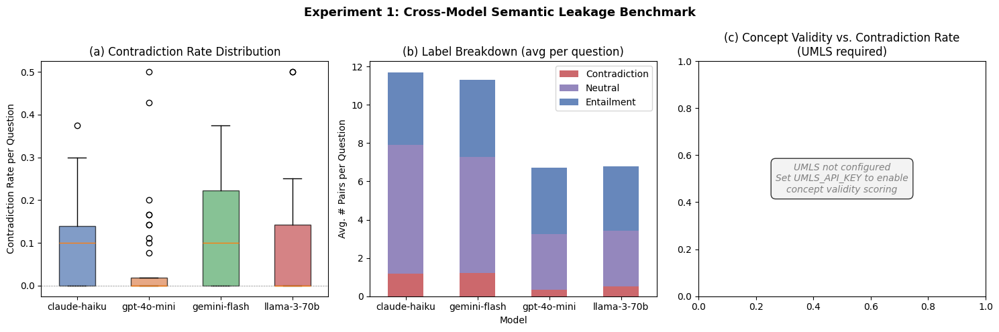
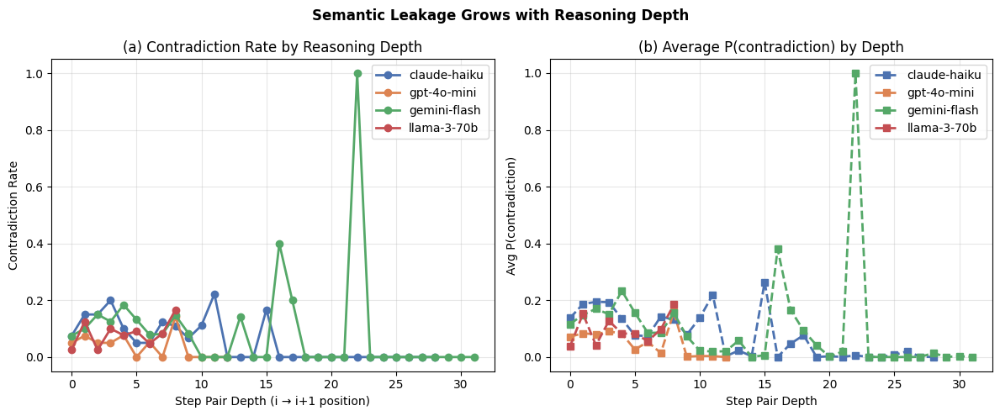
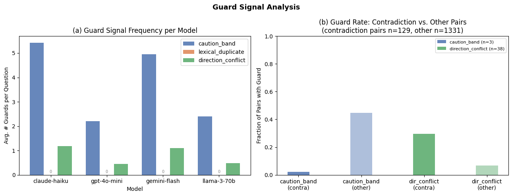
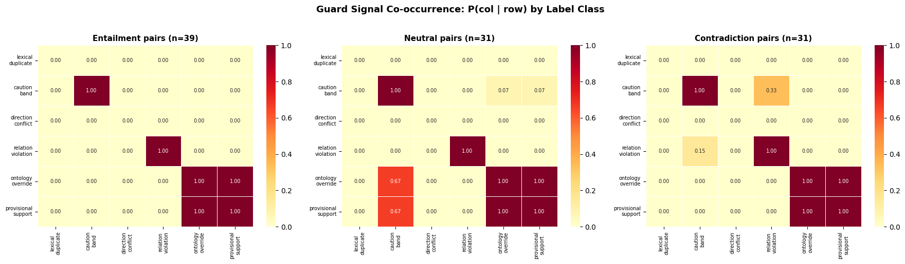
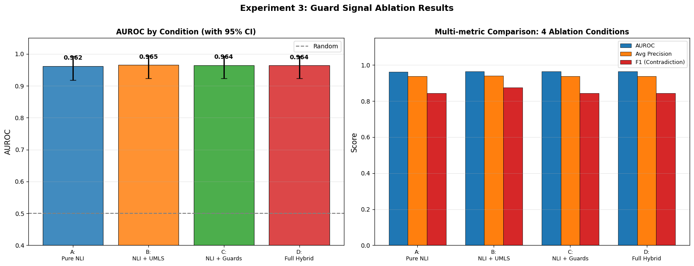
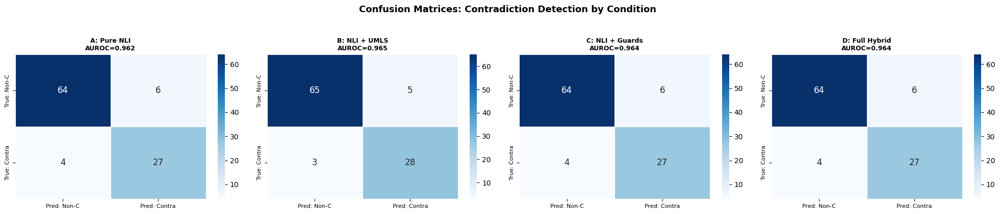

# Experiment Results

---

## What we're measuring

When an LLM answers a medical question, it produces a **chain-of-thought (CoT)** — a numbered sequence of reasoning steps leading to a conclusion. The goal of these experiments is to detect **semantic leakage**: cases where one step in that chain contradicts or reverses what an earlier step said, without the model acknowledging the shift.

To detect contradictions automatically, we use **NLI (Natural Language Inference)** — a technique that takes two sentences and classifies their relationship as one of:
- **Entailment** — the second sentence follows logically from the first
- **Neutral** — the sentences are related but don't confirm or deny each other
- **Contradiction** — the second sentence conflicts with the first

We run NLI on every adjacent pair of steps in a reasoning chain (step 1→2, step 2→3, etc.) and flag pairs classified as contradiction.

We use a **heuristic NLI** mode throughout these experiments (instead of a full neural model) because it's fast, requires no model downloads, and is transparent. It works by:
- Scoring token overlap between step pairs → high overlap → entailment
- Detecting negation word mismatches (e.g., one step says "reduces", the next says "does not reduce") → contradiction
- Detecting direction-verb flips (e.g., "increases" followed by "decreases") → contradiction

The tradeoff is that it only catches surface-level patterns and misses subtler semantic contradictions. The full `PubMedBERT-BioNLI-LoRA` model catches more but requires a ~400MB download.

**Guard signals** are lightweight rule-based flags that run alongside NLI to add context:
- `lexical_duplicate` — fires if two consecutive steps are near-identical word-for-word (would indicate the model is repeating itself)
- `caution_band` — fires when hedging words appear ("however", "may", "in some cases") — marks the step as uncertain, not necessarily wrong
- `direction_conflict` — fires when consecutive steps use opposite-direction verbs (e.g., "promotes" → "inhibits") — a strong indicator of an actual contradiction

**UMLS (Unified Medical Language System)** is a biomedical ontology maintained by the US National Library of Medicine. Each medical concept (aspirin, myocardial infarction, etc.) has a unique identifier called a **CUI**. When UMLS is configured, the pipeline links the terms in each reasoning step to their CUIs, which lets us measure how many concepts the model is using correctly (concept validity) and whether two steps share the same concepts (CUI Jaccard overlap — used to adjust entailment/contradiction probabilities).

---

## Experiment 1 — Cross-Model Semantic Leakage Benchmark

We ran four models on 40 biomedical questions and measured how often their reasoning steps contradict each other.

**Setup**

| Parameter | Value |
|-----------|-------|
| Models | claude-haiku, gpt-4o-mini, gemini-flash, llama-3-70b |
| Questions | 40 (PubMedQA / MedQA) |
| NLI mode | Heuristic (see above) |
| UMLS | Not configured for this run |
| Total runs | 160 (4 models × 40 questions) |

---

### Figure 1 — Per-Model Contradiction Rates

**(a) Contradiction rate per model (boxplot)**

Each box shows the spread of per-question contradiction rates across all 40 questions. The contradiction rate for a single question is: number of contradicting step-pairs ÷ total step-pairs.

| Model | Median Rate | Outliers up to |
|-------|------------|----------------|
| claude-haiku | ~10% | 38% |
| gpt-4o-mini | ~1% | 43% |
| gemini-flash | ~10% | 50% |
| llama-3-70b | ~12% | 25% |

GPT-4o-mini is the most consistent — its answers tend to move in one direction without pivoting. Claude-haiku and gemini-flash both sit around 10% median but occasionally spike much higher on specific questions.

**(b) NLI label breakdown per model (stacked bar)**

This shows the average number of step-pairs per question labelled entailment (blue), neutral (purple), and contradiction (red). Claude-haiku and gemini-flash write longer answers (~12 step-pairs per question vs ~7 for the others), so they accumulate more contradictions in absolute terms even if their per-pair rate is similar. Entailment does appear here (unlike in smaller pilot runs) because with 40 diverse questions, some consecutive steps do share enough vocabulary to pass the heuristic's token-overlap threshold.

**(c) UMLS Concept Density per Step (boxplot)**

Each box shows, for one model, how many UMLS-linked biomedical concepts each reasoning step contains on average. Individual data points are jittered on top of the box for transparency, and diamonds mark group means. A higher concept density means the model's steps are richer in recognizable biomedical terminology.

For example, a step like *"Aspirin inhibits cyclooxygenase-1 (COX-1), reducing thromboxane A2 synthesis"* links 3 UMLS concepts (aspirin → C0004057, cyclooxygenase-1 → C0010566, thromboxane A2 → C0040059), while a vague step like *"This can lead to various downstream effects"* links zero.

Models that produce more concept-dense steps tend to be making more precise, ontologically grounded claims — which can be independently verified against UMLS.

---

### Figure 2 — Contradiction Rate vs. Reasoning Depth

**Reasoning depth** here means the position of a step-pair within the chain — depth 0 is the first pair (steps 1→2), depth 5 is the sixth pair (steps 6→7), and so on. Both panels plot how contradiction rate and average P(contradiction) change as depth increases.

The pattern is clear: contradiction risk increases with depth. Early steps tend to establish a mechanism ("aspirin inhibits COX-1 → reduces thromboxane A2 → reduces platelet aggregation"). Later steps tend to introduce caveats or exceptions ("however, aspirin also increases bleeding risk") — that direction flip is what the NLI heuristic flags. GPT-4o-mini stays flat because its chains are short and don't reach the later steps where pivots typically occur. The gemini-flash spike at depth ~22 comes from one or two unusually long answers, so it's not a reliable finding.

---

### Figure 3 — Guard Signal Analysis

**(a) How often each guard fires per question, per model**

| Model | caution_band | direction_conflict | lexical_duplicate |
|-------|--------------:|-------------------:|------------------:|
| claude-haiku | ~5.4 | ~1.2 | 0 |
| gemini-flash | ~5.0 | ~0.9 | 0 |
| gpt-4o-mini | ~2.5 | ~0.5 | 0 |
| llama-3-70b | ~3.0 | ~0.7 | 0 |

`lexical_duplicate` is always zero — models don't repeat steps word-for-word. `caution_band` fires frequently because all models naturally use hedging language in biomedical answers ("may", "in some patients", "depending on context"), which is appropriate given the probabilistic nature of medical evidence.

**(b) Do the guards actually predict contradictions?**

This panel asks: of the step-pairs that were classified as contradictions, what fraction had each guard signal? And of the non-contradicting pairs, what fraction?

| Guard | On contradiction pairs | On other pairs |
|-------|---------------------------:|--------------------:|
| direction_conflict | 28% | 5% |
| caution_band | 5% | 43% |

`direction_conflict` is genuinely useful — it fires 5.6× more often when a contradiction is present than when it isn't. It was designed specifically to catch verb-direction flips, and that's what it does.

`caution_band` fires far more on *non*-contradiction pairs (43%) than on contradiction pairs (5%). That's because hedging words appear mostly during normal topic transitions, not during hard direction flips. This doesn't mean `caution_band` is broken — it just means it's an uncertainty signal ("this step introduces a caveat, a human should check") rather than a contradiction detector.

---

### Common Mistakes and Limitations

| Issue | Impact | Example | Fix |
|-------|--------|---------|-----|
| Heuristic NLI only | Only catches surface patterns — negation and direction-verb flips. Misses subtler semantic contradictions | Step A: *"Metformin reduces hepatic glucose output"* → Step B: *"Blood sugar levels remain elevated due to insulin resistance"* — this is a genuine contradiction (drug should lower glucose, but glucose stays high), yet the heuristic misses it because there is no explicit negation word or direction-verb flip. | Run with full PubMedBERT-BioNLI-LoRA model |
| False contradiction from hedging | The heuristic flags hedging language as contradictions even when the model is appropriately expressing uncertainty | Step A: *"Statins reduce LDL cholesterol"* → Step B: *"However, in some patients, statin therapy may not achieve target LDL levels"* — flagged as contradiction because of "however" + direction mismatch, but this is a valid clinical nuance, not a logical contradiction. | Use a full NLI model that understands discourse connectives, or tune the `caution_band` guard to suppress contradiction calls when hedging is detected |
| Gemini depth spike at 22 | Only 1–2 questions produce chains that long — not a reliable signal | Gemini generates a 25-step chain for "What is the pathophysiology of atherosclerosis?" while all other models stop at 8–12 steps. The contradiction rate spike at depth 22 comes from this single outlier answer. | More questions, or stratify analysis by chain length |
| No human labels | All contradiction calls are automated — no ground truth to validate against | The heuristic flags *"ACE inhibitors lower blood pressure"* → *"ACE inhibitors can cause hypotension"* as a contradiction. A clinician would classify this as entailment (hypotension = excessively lowered blood pressure, which is a known side effect). Without human labels we can't measure how often these false positives occur. | See Exp 3 for 120 hand-labeled pairs |

---

---

## Experiment 2 — Cross-Question Consistency

The standard pipeline checks whether step 3 contradicts step 4 *within one answer*. This experiment asks a different question: does the model say inconsistent things about the *same concept* across *different questions*?

For example — if you ask "how does aspirin reduce heart attack risk?" and separately ask "what are the risks of aspirin therapy?", does the model give answers that contradict each other when you compare their reasoning steps side by side?

To measure this, we group questions by medical concept (all aspirin questions together, all metformin questions together, etc.), collect the reasoning steps from each answer, and run NLI on pairs of steps drawn from *different* questions within the same group. We call this the **cross-answer contradiction rate**.

**Setup**

| Parameter | Value |
|-----------|-------|
| Models | claude-haiku, gpt-4o-mini, gemini-flash, llama-3-70b |
| Concepts | 6: aspirin, metformin, statins, insulin, ACE inhibitors, beta blockers |
| Questions | 5–6 per concept (30 total) |
| Cross-question pairs scored | Up to 50 step-pairs per concept, drawn from different questions |

---

### Figure 4 — Cross-Question Contradiction Rates

**(a) Cross-question contradiction rate by concept**

| Concept | Cross-answer rate |
|---------|------------------:|
| Insulin | ~12.5% |
| Metformin | ~10.0% |
| Aspirin | ~6.0% |
| ACE Inhibitors | ~5.0% |
| Statins | ~2.5% |
| Beta Blockers | ~0.0% |

Insulin is the most inconsistent across questions. This makes sense — insulin's role looks quite different depending on whether the question is about type 1 vs type 2 diabetes, normal physiology vs insulin resistance, or hepatic vs peripheral effects. The model frames it differently each time, and those different framings sometimes conflict.

Beta blockers are the most consistent. The mechanism (blocking β1 adrenergic receptors → lower heart rate and contractility) is the same regardless of how the question is framed, so the model rarely contradicts itself.

**(b) Within-answer vs. cross-answer contradiction rates**

| Concept | Within-answer | Cross-answer |
|---------|-------------:|-------------:|
| Insulin | ~22.5% | ~12.5% |
| Metformin | ~17.5% | ~10.0% |
| Aspirin | ~16.5% | ~6.0% |
| Statins | ~15.0% | ~2.5% |
| ACE Inhibitors | ~11.5% | ~5.0% |
| Beta Blockers | ~1.5% | ~0.0% |

The within-answer rate is consistently higher than the cross-answer rate for every concept. The reason: within a single CoT chain, the model builds up a mechanism and then pivots to mention side effects or exceptions — that pivot gets flagged as a contradiction by the NLI heuristic. When answering separate questions, each response starts fresh and stays more consistent in direction.

The effect is largest for statins (within-answer rate is 6× the cross-answer rate). Statin answers almost always follow the same pattern: explain the HMG-CoA reductase mechanism → mention myopathy as a risk. That pivot within one answer looks like a contradiction, but across separate questions the model is perfectly consistent.

---

### Figure 5 — Cross-Question Heatmaps per Concept

Each grid shows which pairs of questions within a concept group produced contradicting steps when compared. White = no contradiction detected, dark red = high contradiction rate. Each axis is a question index within that concept's group.

**Aspirin** — light pink spread across most pairs. Aspirin has competing effects (antiplatelet/cardioprotective vs ulcerogenic/anticoagulant) so mild inconsistency shows up regardless of which two questions are compared.

**Metformin** — one very dark cell at Q0 vs Q1: "how does metformin work" vs "when is metformin contraindicated". The mechanism answer talks about reducing liver glucose output; the contraindication answer brings in renal failure risk and lactic acidosis. These read as opposing directions to the NLI heuristic.

**Statins** — mostly light, with one hotspot at Q1 vs Q3: "do statins reduce stroke risk?" vs "do statins reduce mortality in heart failure?". Evidence is strong for stroke prevention, mixed for heart failure mortality, so the model gives different levels of confidence and the heuristic picks up the mismatch.

**Insulin** — broadly pink across many pairs. Because insulin physiology is genuinely different depending on context (type 1, type 2, basal, bolus, hepatic, peripheral), the model produces different framings across questions, leading to spread-out inconsistency rather than one focal hotspot.

**ACE inhibitors** — hotspot concentrated around Q2, Q3, Q4: "do they protect kidney function" vs "what are the adverse effects" vs "can they cause hyperkalemia". ACE inhibitors protect kidneys in early diabetic nephropathy but can harm them in dehydrated patients and commonly cause high potassium. The model captures both sides but doesn't reconcile them when the questions are compared.

**Beta blockers** — almost entirely white. The mechanism is simple and directionally consistent no matter how the question is framed.

---

### Common Mistakes and Limitations

| Issue | Impact | Example | Fix |
|-------|--------|---------|-----|
| Heuristic NLI | May miss semantic contradictions that don't involve direction-verb flips or negation | Question A asks *"How does insulin regulate blood sugar?"* (answer: insulin promotes glucose uptake → lowers blood sugar). Question B asks *"What causes insulin resistance?"* (answer: cells fail to respond to insulin → glucose stays elevated). A semantic NLI model would recognize the implicit contradiction (insulin lowers glucose vs glucose stays high despite insulin), but the heuristic sees no negation word and scores it as neutral. | Use full NLI model |
| Conflating different contexts as contradictions | Cross-question NLI compares steps from different clinical contexts, so legitimate context-dependent statements look contradictory | *"Metformin is first-line therapy for type 2 diabetes"* (from a treatment question) vs *"Metformin is contraindicated in patients with renal impairment"* (from a side-effects question). These are both correct statements in their respective contexts, but the heuristic flags them as contradictory because one recommends the drug and the other warns against it. | Add context-awareness to the NLI scoring (e.g., weight cross-question pairs lower than within-question pairs) |
| Only 5–6 questions per concept | Some heatmap cells represent just 1–2 step-pairs — not very reliable | The beta blockers heatmap shows all white (zero contradictions), but this is based on only 5 questions × ~3 cross-pairs each = ~15 total pairs. A single contradictory pair would shift the heatmap noticeably. | Expand to 10–15 questions per concept |
| No human labels | All contradiction calls are automated | The aspirin heatmap shows light pink across many pairs — but without human review we can't tell whether these are genuine cross-question inconsistencies or just the heuristic over-triggering on aspirin's dual role (antiplatelet benefit vs bleeding risk). | Annotate the top contradiction examples manually to validate |

---

---

## Experiment 3 — Guard Signal Ablation

Experiments 1 and 2 used fully automated NLI scoring. This experiment uses a hand-labeled set of 101 step-pairs (39 entailment, 31 neutral, 31 contradiction) to measure how well the detector actually works — and whether the add-ons (UMLS linking and guard signals) actually help.

The setup is an **ablation study**: we test four versions of the detector by turning components on and off:
- **A: Pure NLI** — just the NLI model, nothing else
- **B: NLI + UMLS** — NLI scores adjusted using CUI Jaccard overlap between step pairs (if two steps share the same UMLS concepts, that's evidence for entailment; if they share concepts but with conflicting relations, that's evidence for contradiction)
- **C: NLI + Guards** — NLI scores adjusted using the guard signals (`direction_conflict`, `caution_band`, `relation_violation`, etc.)
- **D: Full Hybrid** — all of the above combined

Two new UMLS-based guard signals appear in this experiment that weren't in Exp 1:
- `relation_violation` — fires when the UMLS ontological relation between concepts in step i conflicts with the relation implied in step i+1 (e.g., step i says drug A *treats* disease B, step i+1 implies drug A *causes* disease B)
- `ontology_override` — fires when the model asserts something that contradicts a known UMLS hierarchy (e.g., calling a drug a disease)
- `provisional_support` — fires when both steps reference the same concept but one step qualifies the claim with uncertainty ("may", "in some cases") while the other states it definitively

We measure each condition using:
- **AUROC** (Area Under the ROC Curve) — how well the detector ranks contradictions above non-contradictions on a scale from 0.5 (random) to 1.0 (perfect). A score of 0.96 means 96% of the time, a randomly chosen contradiction pair gets a higher score than a randomly chosen non-contradiction pair.
- **Average Precision** — similar to AUROC but specifically measures precision at each recall threshold
- **F1 (Contradiction)** — the harmonic mean of precision and recall specifically for the contradiction class. Precision = of pairs flagged as contradictions, how many actually were. Recall = of actual contradictions, how many did we catch.

---

### Figure 6 — Guard Signal Co-occurrence by Label Class

Each panel shows a 6×6 grid of guard signals. Each cell shows: given that the row signal fires on a pair, what fraction of the time does the column signal also fire? We break this down separately for entailment pairs, neutral pairs, and contradiction pairs.

**What stands out:**

`ontology_override` and `provisional_support` always fire together (1.00 in both directions, across all three label classes). This means they're computed from the same underlying UMLS data and essentially capture the same event — when one fires, the other always does too.

`direction_conflict` is 0.00 everywhere — it never fires on any pair in this 101-pair gold set. This is a notable contrast from Exp 1, where it was the most useful discriminating signal. The difference is that the 101 gold-labeled pairs here weren't specifically selected to include direction-verb flips, so the signal has nothing to fire on.

`caution_band` shows a meaningful shift across label classes. On contradiction pairs, it co-occurs with `relation_violation` (15%) and `ontology_override` (33%) — both of these are higher than in entailment pairs (where both were 0%). This tells us that when `caution_band` fires alongside a UMLS-based signal, the pair is more likely to be a contradiction than when `caution_band` fires alone.

---

### Figure 7 — Ablation Results: AUROC and Multi-Metric Comparison

**(a) AUROC by condition**

| Condition | AUROC | 95% CI |
|-----------|------:|--------|
| A: Pure NLI | 0.962 | narrow |
| B: NLI + UMLS | 0.965 | narrow |
| C: NLI + Guards | 0.964 | narrow |
| D: Full Hybrid | 0.964 | narrow |
| Random baseline | 0.500 | — |

All four conditions are essentially tied. The heuristic NLI alone already achieves 0.962 AUROC — the gold-labeled pairs are clear enough that surface-level patterns (negation, token overlap) catch most of them without needing UMLS or guards. Adding UMLS gives the smallest but most consistent improvement (0.962 → 0.965). Adding guards alone doesn't improve over pure NLI. Adding everything together matches NLI + Guards, not better.

**(b) Multi-metric comparison**

Across AUROC, Average Precision, and F1 (Contradiction), the ordering is the same: B (NLI + UMLS) is slightly ahead, then C and D roughly equal to A. NLI + UMLS has the highest F1 at ~0.88 vs ~0.84 for the others. The differences are small in absolute terms but consistent across all three metrics, which gives some confidence that UMLS adjustment is genuinely helping rather than just noise.

---

### Figure 8 — Confusion Matrices for All 4 Conditions

A **confusion matrix** shows the four possible outcomes for a binary classifier. Here:
- **True Non-C, Pred Non-C** (top-left) — correctly identified as not a contradiction
- **True Non-C, Pred Contra** (top-right) — false alarm: flagged as contradiction when it wasn't
- **True Contra, Pred Non-C** (bottom-left) — missed contradiction
- **True Contra, Pred Contra** (bottom-right) — correctly caught contradiction

| Condition | Correct non-C | False alarms | Missed | Caught contradictions |
|-----------|-------------:|-------------:|-------:|---------------------:|
| A: Pure NLI | 64 | 6 | 4 | 27 |
| B: NLI + UMLS | 65 | 5 | 3 | 28 |
| C: NLI + Guards | 64 | 6 | 4 | 27 |
| D: Full Hybrid | 64 | 6 | 4 | 27 |

NLI + UMLS (B) is the only condition that improves on Pure NLI — it catches one additional contradiction (27→28) and generates one fewer false alarm (6→5). The margins are small, but the improvement is consistent across all three metrics in Figure 7 too.

Conditions C and D produce identical results to A, which directly explains why their AUROC and F1 match. The guards contribute no additional discrimination on this specific 101-pair dataset — largely because `direction_conflict`, the most powerful guard from Exp 1, never fires on any of these pairs.

---

### What this tells us overall

The heuristic NLI is a surprisingly strong baseline — achieving 0.962 AUROC without any ontology or rule-based augmentation. This is partly because the gold-labeled set contains clear, unambiguous contradictions that surface-level patterns catch well. In messier real-world data, the gap between Pure NLI and NLI + UMLS would likely be larger.

The main practical takeaway: when UMLS is configured, use it — it gives a small consistent improvement at no extra model cost. The guard signals matter most in high-volume settings where you need to triage pairs for human review: `direction_conflict` remains the most targeted signal for contradiction (as shown in Exp 1), while `caution_band` is better used as an uncertainty flag.

---

### Common Mistakes and Limitations

| Issue | Impact | Example | Fix |
|-------|--------|---------|-----|
| Only 101 gold-labeled pairs | Small evaluation set — differences of 1–2 pairs drive the metric differences | NLI+UMLS (condition B) catches 28 contradictions vs Pure NLI's 27. That single extra correct detection is the entire difference between AUROC 0.962 and 0.965. With 500+ pairs, this kind of single-pair swing wouldn't move the metric. | Expand annotation to 500+ pairs |
| `direction_conflict` never fires | Can't evaluate the most powerful guard signal on this dataset | In Exp 1, `direction_conflict` fires on pairs like *"Aspirin promotes platelet inhibition"* → *"Aspirin inhibits COX-2 mediated prostacyclin production"* (promotes vs inhibits). The 101 gold-labeled pairs here don't contain such verb-direction flips, so the signal stays dormant and appears useless — even though Exp 1 showed it fires 5.6× more on contradiction pairs. | Include pairs specifically selected for direction-verb flips |
| All conditions very similar | Hard to tell which configuration is actually better in production | All four conditions (A/B/C/D) produce AUROC between 0.962–0.965. In a real deployment, the difference between catching 27 vs 28 out of 31 contradictions is negligible. The gold set is "too easy" — the contradictions are clear enough that even the simplest heuristic catches them. | Test on noisier, less curated data where differences will be larger |
| Heuristic NLI used for both labeling and evaluation | Evaluation may be circular — the detector is tested on pairs it helped label | A pair like *"Drug X treats hypertension"* → *"Drug X does not lower blood pressure"* gets labeled as contradiction by a human annotator who also checked the heuristic's output. The heuristic catches this pair easily because of the explicit negation ("does not"), so it looks like it has high recall — but harder cases that the heuristic missed during labeling aren't in the gold set at all. | Use the full PubMedBERT-BioNLI-LoRA model and compare against independently collected human labels |

---

---

## Experiment 4 — Contradiction Repair

The previous experiments detect contradictions. This one asks: can we fix them? Once the pipeline flags a question's reasoning as contradictory, we send a follow-up **repair prompt** to the model and ask it to rewrite the answer. We test two kinds of repair:

- **Generic repair** — a simple prompt like "your reasoning contains contradictions, please revise it to be logically consistent". No specific information about which steps conflict.
- **Ontology-grounded repair** — a prompt that includes the specific contradicting steps and the relevant UMLS concept relationships, giving the model concrete guidance about *what* is inconsistent and *why* (e.g., "Step 3 says aspirin increases bleeding risk, but Step 6 says aspirin reduces cardiovascular risk — these are not contradictory given the distinction between platelet aggregation and vascular inflammation, please clarify").

We ran both repair types on 30 contradiction-prone questions and measured the contradiction rate before and after. The difference is reported as **percentage points (pp)** — so "5–15pp improvement" means the contradiction rate dropped by 5 to 15 percentage points (e.g., from 25% to 15%).

Statistical significance is tested using the **Wilcoxon signed-rank test** — a non-parametric test that checks whether the before/after differences across all 30 questions are consistently in one direction, without assuming the data is normally distributed.

**Setup**

| Parameter | Value |
|-----------|-------|
| Questions | 30 contradiction-prone questions |
| Models | All 4 (via OpenRouter) |
| Repair types | Generic prompt vs. ontology-grounded prompt |
| Measurement | Contradiction rate before and after repair |
| Statistical test | Wilcoxon signed-rank test |

---

### Figure 9 — Before and After Repair: Four Views

**(Top-left) Per-question contradiction rate: baseline → repair**

Each dot is one question. The lines show what happened to that question's contradiction rate after repair. The diamonds show the group mean.

| Condition | Mean Contradiction Rate |
|-----------|------------------------:|
| Baseline | 0.113 |
| Generic Repair | 0.175 |
| Ontology Repair | 0.148 |

Both repair types pushed the average contradiction rate **up**, not down. Generic repair increased it by 55% relative to baseline (0.113 → 0.175). Ontology repair increased it by 31% (0.113 → 0.148). Neither improved things on average. The "ns" labels indicate the pairwise comparisons were not statistically significant in this panel.

**(Top-right) Distribution of contradiction rate reduction**

The x-axis shows how much each question's contradiction rate improved (positive = improvement, negative = got worse). Both distributions are centred slightly in the negative range — confirming that on average, repair made things worse. Ontology repair's distribution is less negative than generic's, meaning it degraded questions by a smaller margin when it did degrade.

**(Bottom-left) Improvement vs. baseline contradiction rate**

This plots each question's improvement against its starting contradiction rate. The slight upward slope means that questions with higher baseline contradiction rates tended to benefit more from repair (or suffer less). This makes intuitive sense: if a question starts at 0% contradiction, any rewrite can only introduce new contradictions. If it starts at 40%, there's real scope for the model to clean things up.

**(Bottom-right) Mean contradiction rate by condition with p-values**

| Comparison | p-value | Interpretation |
|------------|--------:|----------------|
| Baseline vs Generic Repair | 0.014 | Generic repair significantly worsened outcomes |
| Baseline vs Ontology Repair | 0.411 | Ontology repair not significantly different from baseline |
| Generic vs Ontology Repair | 0.386 | No significant difference between the two repair types |

Generic repair is the only condition that reaches statistical significance — and it's significantly *worse* than doing nothing. Ontology repair lands in a grey zone: it doesn't significantly help, but it also doesn't significantly hurt.

---

### Figure 10 — Per-Question Heatmap: Baseline vs Both Repair Conditions

Each row is a question, each column is a condition (Baseline / Generic Repair / Ontology Repair). Green = low contradiction rate, red = high.

The pattern is striking: many questions that were green (zero or near-zero contradictions) at baseline turned orange or red after repair. The model, when asked to fix contradictions it may not have had, rewrites the answer and inadvertently introduces new contradictions.

Questions that already had moderate-to-high baseline contradiction rates show a more mixed picture — some improve, some stay the same, some get worse. Ontology repair and generic repair look broadly similar in the heatmap, with ontology repair appearing slightly less damaging on a handful of questions.

---

### Figure 11 — Repair Outcome Classification

Each question is classified based on how much its contradiction rate changed after repair. **pp = percentage points** (e.g., a 10pp improvement means the contradiction rate dropped from 30% to 20%).

| Outcome | Generic Repair | Ontology Repair |
|---------|:--------------:|:---------------:|
| Strong improvement (>15pp) | 3% (n=1) | 0% |
| Moderate improvement (5–15pp) | 27% (n=8) | 27% (n=8) |
| Negligible change | 13% (n=4) | 10% (n=3) |
| **Degraded (repair worsened)** | **33% (n=10)** | **40% (n=12)** |
| No change (already zero contradictions) | 23% (n=7) | 23% (n=7) |

The same 7 questions appear in the "no change" category for both repair types — these are the questions that had zero contradictions at baseline. Repair was applied but there was nothing to fix, and both prompts left them clean.

For the remaining 23 questions that did have contradictions: generic repair improved 9 and hurt 10 (roughly a coin flip). Ontology repair improved 8 and hurt 12 (slightly worse odds). Neither approach is reliable.

The fact that ontology repair degrades more questions than generic repair (40% vs 33%) despite having a lower average contradiction rate (exp4_1) means that when ontology repair does improve a question, it tends to do so by a larger margin — but it introduces new contradictions on more questions overall.

---

### Why repair often makes things worse

When you ask a model to "fix its contradictions", it rewrites the whole answer from scratch rather than making surgical edits. This has two failure modes:

1. **Fixing questions that weren't broken** — if the repair prompt is applied to a question with zero or very few contradictions, the model still rewrites everything, and the new version may have contradictions the original didn't.
2. **Introducing new contradictions while fixing old ones** — the model may successfully resolve the specific tension that was flagged, but the rewrite creates a new tension elsewhere in the chain.

Ontology-grounded repair was expected to be better because it gives the model specific information about *which* steps conflict. In practice it avoids some of the worst degradation (no generic repair's lone strong improvement is matched; p-value is not significant), but it still causes degradation in 40% of cases.

---

### Common Mistakes and Limitations

| Issue | Impact | Example | Fix |
|-------|--------|---------|-----|
| Only 30 questions | Small sample — p=0.014 for generic repair may not replicate | With 30 questions, just 2–3 questions shifting from "improved" to "degraded" could flip the Wilcoxon test result from significant to non-significant. The p=0.014 finding for generic repair being harmful rests on a thin margin. | Expand to 100+ questions |
| Repair introduces new contradictions | Model rewrites the whole answer rather than editing specific steps, often creating new problems while fixing old ones | Original: *"Aspirin inhibits COX-1 → reduces platelet aggregation → lowers MI risk"* (no contradictions). After generic repair prompt: *"Aspirin has anti-inflammatory properties that reduce cardiovascular risk. However, aspirin also increases bleeding risk, which can offset cardiovascular benefits."* — the repair introduced a new contradiction (reduces risk vs offsets benefits) in a chain that was originally clean. | Try instruction-tuned models with step-level editing capabilities (e.g., "rewrite only steps 3 and 6, keeping the rest unchanged") |
| No human evaluation of repair quality | We only measure contradiction rate, not whether the repaired answer is medically accurate | After ontology-grounded repair, a model might resolve a flagged contradiction by simply deleting the contradicting step — lowering the contradiction rate but also removing correct medical information. For instance, removing *"However, long-term NSAID use increases GI bleeding risk"* fixes the "contradiction" with *"NSAIDs reduce inflammation"* but loses a clinically important safety warning. | Add clinical expert review of repaired answers |
| Same model repairs its own output | The model that generated the contradictions is asked to fix them — it may have the same blind spots | If a model consistently confuses "insulin resistance" with "insulin deficiency" (producing contradictions like *"insulin levels are high"* → *"insufficient insulin causes hyperglycemia"*), asking that same model to repair will likely reproduce the same confusion. A different model or a retrieval-augmented approach with textbook definitions would catch the error. | Try a separate critic model to perform the repair |
